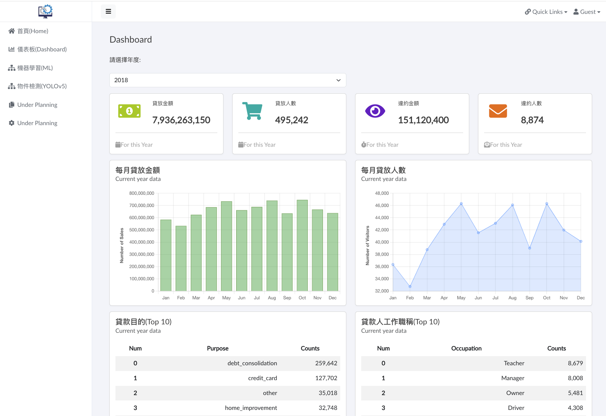

# **c_sharp_demo_01**

## **自學C# - 簡單網頁展示**

#### **1. 目的：** 
經過半個月的時間自學 C# 及 ASP.NET Core MVC，希望藉由總結實作的程式碼來瞭解學習狀況，即知道目前可以掌握技術知識點。

#### **2. 使用相關框架或套件：**
ASP.NET Core MVC、FastAPI、PostgreSQL、Chart.js、Bootstrap、YOLOv5…等。

#### **3. 簡介：** 
前端使用ASP.Net Core MVC處理網頁，樣式套用Boostrap-simple-admin。後端則以FastAPI建立API操作資料庫PostgreSQL、處理資料及模型推論運算，供前端調用渲染網頁。
網頁示範內容之資料來自 Kaggle 的 lending club數據集，作簡易的探索性分析及建模預測。主要為展示程式技術，故僅列出幾個統計圖表，如 [選單二] 的「儀表板」，有下拉式選單切換分析年度。另外，違約預測分析只使用幾個模型變數作訓練，如 [選單三] 的「機器學習」，後端佈署模型預測API供前端調用，在Form輸入各項數據送出後在下方返迴預測結果。接著，[選單四] 為「物件檢測」，檢測物件為食物，可從前端將圖片檔上傳給後端YOLOv5封裝之API處理，於下方返回檢測圖片。
最後，由Docker Compose佈署前端、後端、資料庫及相關服務。部份頁面及說明如下：

(1)首頁
- 頁面為左方導覽列(Navbar)，右方呈現內容。樣式套用Bootsrap-simple-admin ([詳見](<https://github.com/pro-dev-ph/bootstrap-simple-admin-template>))作簡化。

 

(2)選單二 - 儀表板 

- 調用API從資料庫擷取數據處理後渲染網頁，圖表以Chart.js繪製，下拉式選單可切換分析年度。

(3)選單三 - 機器學習 

- 可點選演算法及填寫變數資料送出Form，調用模型API運算，預測結果返回網頁。

(4)選單四 - 物件檢測 

- 可上傳圖片檔，調用YOLOv5模型API作推論，檢測結果返回網頁。此處目的僅是YOLO模型推論佈署之練習，引用之模型及內容 ([詳見](<https://medium.com/@auliyafirdaus03/step-by-step-deploy-yolov5-ultralytics-machine-learning-model-with-fastapi-ef6faacea4ee>))。

(5)API接口 
- FastAPI建立不同功能的API接口，如："/api/all_years"為列出各年度之陣列，其他接口詳見程式碼。

